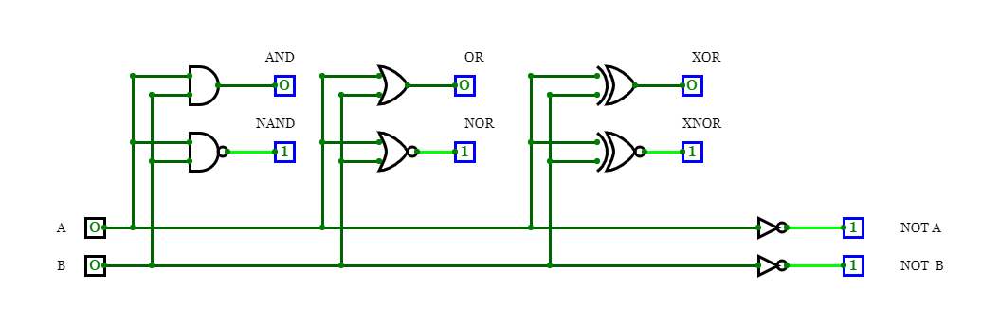
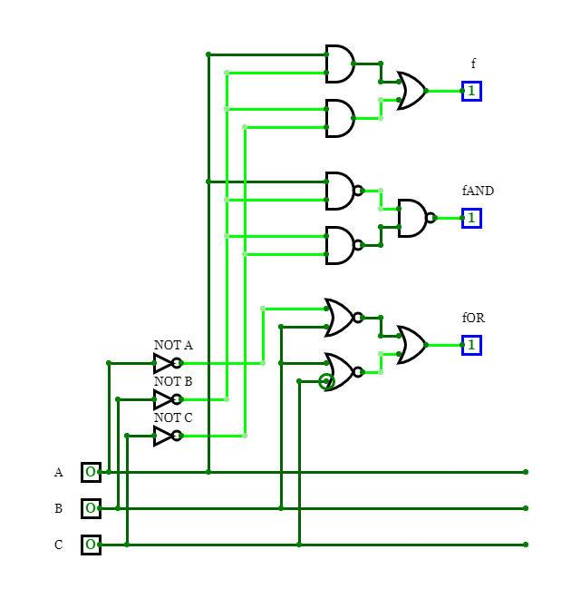

# First lecture (01-gates)

Basic AND, NAND, OR NOR, XOR, XNOR and NOT gates and its outputs.

## Output tables

#### AND && NAND Table
| **A** | **B** | **AND** | **NAND** |
| :-: | :-: | :-: | :-: |
| 0 | 0 | 0 | 1 |
| 0 | 1 | 0 | 1 |
| 1 | 0 | 0 | 1 |
| 1 | 1 | 1 | 0 |

#### OR && NOR Table
| **A** | **B** | **OR** | **NOR** |
| :-: | :-: | :-: | :-: |
| 0 | 0 | 0 | 1 |
| 0 | 1 | 1 | 0 |
| 1 | 0 | 1 | 0 |
| 1 | 1 | 1 | 0 |

#### XOR && NXOR Table
| **A** | **B** | **XOR** | **NXOR** |
| :-: | :-: | :-: | :-: |
| 0 | 0 | 0 | 1 |
| 0 | 1 | 1 | 0 |
| 1 | 0 | 1 | 0 |
| 1 | 1 | 0 | 1 |

### Simple Animation

###  De Morgan's law and combinational circuit

 &nbsp;

 

 &nbsp;

 

 &nbsp;

#### Combinational table

 | **A** | **B** |**C** |  |  |  |
 | :-: | :-: | :-: | :-: | :-: | :-: |
 | 0 | 0 | 0 | 1 | 1 | 1 |
 | 0 | 0 | 1 | 0 | 0 | 0 |
 | 0 | 1 | 0 | 0 | 0 | 0 |
 | 0 | 1 | 1 | 0 | 0 | 0 |
 | 1 | 0 | 0 | 1 | 1 | 1 |
 | 1 | 0 | 1 | 1 | 1 | 1 |
 | 1 | 1 | 0 | 0 | 0 | 0 |
 | 1 | 1 | 1 | 0 | 0 | 0 |

#### Combinational circuit simulation

