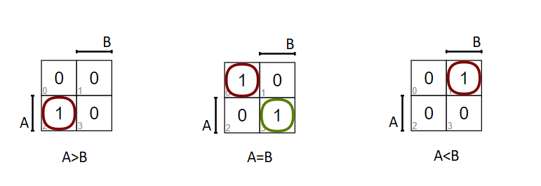

# 2. lecture (02-ise)

#### Contents

1. [Homework](#Homework)

<!--
2. [Used hardware components](#Used-hardware-components)
3. [Synchronize Git and create a new folder](#Synchronize-Git-and-create-a-new-folder)
4. [Digital circuits in VHDL language](#Digital-circuits-in-VHDL-language)
5. [Clean project and synchronize git](#Clean-project-and-synchronize-git)
6. [Ideas for other tasks](#Ideas-for-other-tasks)
-->

## Homework

1. *Binary comparator* true table.

    | **A** | **B** | **A>B** | **A=B** | **A<B** |
    | :-: | :-: | :-: | :-: | :-: |
    | 0 | 0 | **0** | **1** | **0** |
    | 0 | 1 | **0** | **0** | **1** |
    | 1 | 0 | **1** | **0** | **0** |
    | 1 | 1 | **0** | **1** | **0** |

2.   **SoP** and **PoS** output forms as follows

Create K-maps for all three functions.

Use the K-map to create the minimum  function.

&nbsp;

&nbsp;

> Equations and symbols were generated by [Online LaTeX Equation Editor](https://www.codecogs.com/latex/eqneditor.php) as an Encoded URL link.
>
